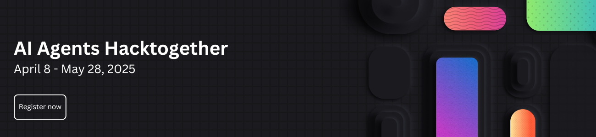

# AI Agents Hackathon 2025: Build the Future of AI!

🛠️ Build, innovate, and #Hacktogether! 🛠️

2025 is the year of AI agents! But what exactly is an agent, and how can you build one? Whether you're a seasoned developer or just starting out, this **FREE three-week virtual hackathon** is your chance to dive deep into AI agent development.

🔥 Learn from **20+ expert-led sessions** streamed live on YouTube, covering top frameworks like **Semantic Kernel**, **Autogen**, the new **Azure AI Agents SDK** and the **Microsoft 365 Agents SDK**.

💡 Get hands-on experience, unleash your creativity, and build powerful AI agents—then submit your hack for a chance to win **amazing prizes!** 💸

[Learn more here!](https://microsoft.github.io/AI_Agents_Hackathon)